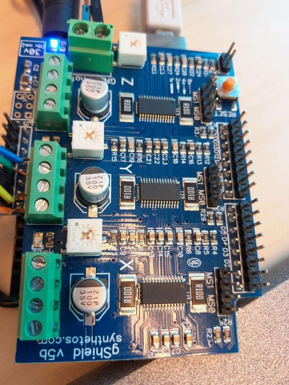
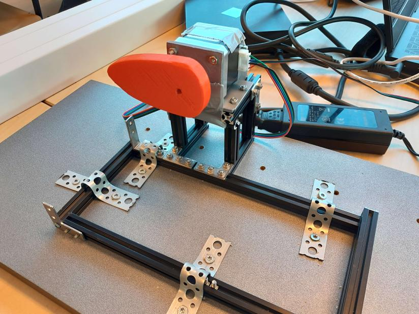
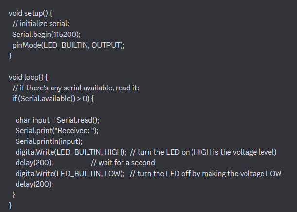

# Fake-Taxi 

<h1> Content</h1>
* What's our goal
* How does it work?
* The programs we used (and how to install them)
* How do we send code to the motor?
* How to use the programs?
* Problem we experienced
* Parts
* How to set up the dev environment
* How to ship a change
* Change log
* License and author info
  
<h1>What's our goal?</h1>
Our goal is to make a taxi that will go up on it's backwheels so it'll jump up and down. This taxi will then later be implemented in an escape room.

<h1>How does it work?</h1>
To lift the taxi we use a mechanical system made with some maker beams, supported by a stepping motor (42BYG-40015-22B). The motor has a 3D print attached to it. The 3D goes up for 90 degrees and then goes down to it original location, it does this movement for about 5 times. The print pushes against an U-form profile at the back of the taxi, this makes the taxi go up and down. The motor is connected to the Gshield V5b which is connected to an arduino uno microcontroller. Using specific software we're able to lift the taxi from the ground.
  
 
<h1>The programs we used (and how to install them)</h1>
Used program links:
<ul>
<li>Tinkercad (for our 3D print): https://www.tinkercad.com/</li>
<li>Universal gcode: https://universalgcodesender.com/download/</li>
<li>Arduino IDE: https://www.arduino.cc/en/software</li>
<li>Serial import in Python (commands):</li>
conda create --name helloworld  
conda activate helloworld   
conda env list (to see all environments)   
</ul>
<h1>How do we send code to the motor?</h1>
We use a gshield v5b as a motor driver (it has 3 drivers, we used Y). With the GRBL library this Gshield can communicate with an Arduino Uno which is attatched to it.
With serial data input from TX to RX we can send our code to make the motor run to the Arduino, using GCODE. Below this you see a code snippet from our code in Python.
Initially, we used Universal gcode to let the motor turn around, later on we programmed this ourself in Python.

<h1>How to use the programs?</h1>
<ul>
<li>Universal gcode (to let the motor turn): 
<ol>
<li>Open Arduino IDE --> file --> examples --> grbl --> grblUpload: execute</li>
<li>UGS: open and connect</li>
<li>Now use the GUI at the left to make the motor turn </li>
</ol></li>
  
<li>Arduino IDE: 
1. Code to implement the gcode to Arduino:
File>Examples>grbl>grblUpload
/**
This sketch compiles and uploads Grbl to your 328p-based Arduino! 

To use:
- First make sure you have imported Grbl source code into your Arduino
  IDE. There are details on our Github website on how to do this.

- Select your Arduino Board and Serial Port in the Tools drop-down menu.
  NOTE: Grbl only officially supports 328p-based Arduinos, like the Uno.
  Using other boards will likely not work!

- Then just click 'Upload'. That's it!

For advanced users:
  If you'd like to see what else Grbl can do, there are some additional
  options for customization and features you can enable or disable. 
  Navigate your file system to where the Arduino IDE has stored the Grbl 
  source code files, open the 'config.h' file in your favorite text 
  editor. Inside are dozens of feature descriptions and #defines. Simply
  comment or uncomment the #defines or alter their assigned values, save
  your changes, and then click 'Upload' here. 

Copyright (c) 2015 Sungeun K. Jeon
Released under the MIT-license. See license.txt for details.
**/

#include <grbl.h>

// Do not alter this file!
</li>
<li>Python code (programmed in Visual Studio Code)
<ol>
<li>Code for the communication between arduino. When the input is hello world the led of the arduino turns on. We used this as a first test to see if everything works.)
import serial
import time

ser = serial.Serial('COM6', 115200)

time.sleep(2)

command = input("Enter a command: ")

if command == "hello world":
  ser.write(command.encode())
  time.sleep(1)
  ser.write(b'off') 

ser.close()
</li>
<li>Gcode generator code:
mport serial
import time

ser = serial.Serial('COM6', 115200)

time.sleep(2)

y_pos = -11
feed_rate = 1000
y_pos2 = 0

g_code = "G21 \n"
g_code += "G90 \n"
g_code += "G01 F{} Y{} \n".format(feed_rate, y_pos)

g_code2 = "G21 \n"
g_code2 += "G90 \n"
g_code2 += "G01 F{} Y{} \n".format(feed_rate, y_pos2)

for i in range (3):
    ser.write(g_code.encode())
    ser.write(g_code2.encode())

ser.close()

Test met library mecode die niet werkt:
import mecode
import time

g = mecode.G(
    direct_write=True,
    two_way_comm=False,
    direct_write_mode="serial",
    printer_port="COM6",
    setup=False,
    baudrate=115200)

(#) g.absolute()
(#) g.setup()
g.write("G21 ", resp_needed=False)
g.write("G90 ", resp_needed=False)
g.write("G1 F1000 Y10 ", resp_needed=False)
(#) g.abs_move(x=0,y=10,z=0, F=1000)
g.teardown()
</li>
</ol>
</li>

<li>

Arduino test code Hello World:

</li>
</ul>

<h1>Problem we experienced</h1>

Because we only use a simple stepping motor, the real taxi (weight is more than 2.5kg) can't lift up. To show the system itself does work, we used a taxi in cardboard. But if you have a heavier motor, it should have to work perfectly.

<h1>Parts</h1>
<ul>
<li>Stepping motor, datasheet: https://media.digikey.com/pdf/Data%20Sheets/Makeblock%20PDFs/81042_Web.pdf</li>
<li>Arduino Uno</li>
<li>Gshield v5b</li>
</ul>
Because we only use a simple stepping motor, the real taxi (weight is more than 2.5kg) can't lift up. To show the system itself does work, we used a taxi in cardboard. But if you have a heavier motor, it should work perfectly.

<h1>How to set up the dev environment</h1>

<h1>How to ship a change</h1>

<h1>Change log</h1>

<h1>License and author info</h1>
Made by Esteban Desmedt, Colin Bossuyt, Xander Vyvey and Alberiek Depreytere in 2023 for VIVES.