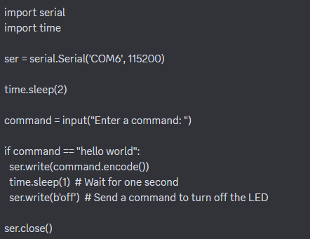

# Fake-Taxi 

<h1>What's our goal?</h1>
Our goal is to make a taxi that will go up on it's backwheels so it'll jump up and down. This taxi will then later be implemented in an escape room.

<h1>How does it work?</h1>
To lift the taxi we use a mechanical system made with some maker beams, supported by a stepping motor (42BYG-40015-22B). The motor has a 3D print attached to it. The 3D goes up for 90 degrees and then goes down to it original location, it does this movement for about 5 times. The print pushes against an U-form profile at the back of the taxi, what makes the taxi go up and down. The motor is connected to the Gshield V5b which is connected to an arduino uno microcontroller. Using specific software we're able to lift the taxi from the ground.
  
 
<h1>The programs we used (and how to install them)</h1>
Used program links:
- Tinkercad (for our 3D print): https://www.tinkercad.com/ 
- Universal gcode: https://universalgcodesender.com/download/ 
- Arduino IDE: https://www.arduino.cc/en/software 
- Serial import in Python (commands): 
conda create --name helloworld 
conda activate helloworld 
conda env list (om alle environments te zien)

<h1>How do we send code to the motor?</h1>
We use a gshield v5b as a motor driver (it has 3 drivers, we used Y). With the GRBL library this Gshield can communicate with an Arduino Uno which is attatched to it.
With serial data input from TX to RX we can send our code to make the motor run to the Arduino, using GCODE. Below this you see a code snippet from our code in Python.
Initially, we used Universal gcode to let the motor turn around, later on we programmed this in Python ourself.

<h1>How to use the programs?</h1>
- Universal gcode (to let the motor turn): 
1. Open Arduino IDE --> file --> examples --> grbl --> grblUpload: execute
2. UGS: open and connect
3. Now use the GUI at the left to make the motor turn
  
- Arduino IDE: 
1. 

-Arduino test code Hello World:

-Python code for sending Hello world to Arduino Uno and get a blinking rgb led:

<h1>Problems we experienced</h1>
Because we only use a simple stepping motor, the real taxi (weight is more than 2.5kg) can't lift up. To show the system itself does work, we used a taxi in cardboard. But if you have a heavier motor, it should have to work perfectly.

<h1>How to set up the dev environment</h1>

<h1>How to ship a change</h1>

<h1>Change log</h1>

<h1>License and author info</h1>
Made by Esteban Desmet, Colin Bossuyt, Xander Vyvey and Alberiek Depreytere in 2023 for VIVES.