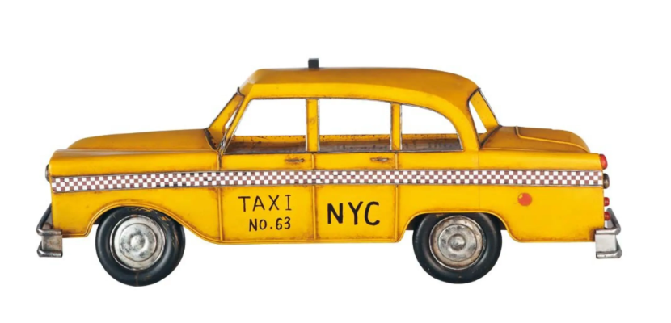

# Fake-Taxi + Boris de Dino

<h1>What your project does</h1>
The project concerning the taxi will lift the taxi on it's backwheels using a mechanical system supported by a motor (42BYG-40015-22B). The motor has a 3D print attached to it.
This motor is connected to the Gshield V5b which is alo connected to the arduino uno microcontroller. Using specific software we're able to lift the taxi from the ground.
  

<h1>How to install it</h1>
Used program links:

- Tinkercad (for controlling the engine): https://www.tinkercad.com/ 

- Universal gcode: https://universalgcodesender.com/download/ 

- Arduino IDE: https://www.arduino.cc/en/software 

- Serial import in Python (commands): conda create --name helloworld ,
conda activate helloworld ,
conda env list (om alle environments te zien)

<h1>Example usage</h1>

- Tinkercad: 

- Universal gcode: 

1. Open Arduino IDE --> file --> examples --> grbl --> grblUpload: execute

2. UGS: open and connect

3. Now use the GUI at the left to make the motor turn

- Arduino IDE: 

<b>(in te vullen door Colin)</b>

<h1>How to set up the dev environment</h1>

<h1>How to ship a change</h1>

<h1>Change log</h1>

<h1>License and author info</h1>